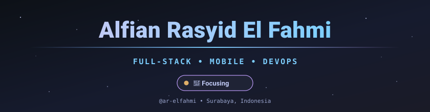

<!-- @ar-elfahmi — GitHub Profile README -->
<!-- Tip: If any dynamic card ever shows an error, see the "Self-hosting note" at the bottom. -->

<div align="center">



<!-- Status badges -->
<a href="https://github.com/ar-elfahmi?tab=followers"></a>
<a href="https://www.google.com/maps/place/Surabaya"></a>
<a href="#"></a>


<!-- Typing animation -->
<a href="https://github.com/ar-elfahmi">
  
</a>

</div>

---

## 👨‍💻 &nbsp;About Me

```yaml
name: "Alfian Rasyid El Fahmi"
role: "Informatics Engineering Student"
based_in: "Surabaya, Indonesia 🇮🇩"
education: "Universitas Airlangga (UNAIR) · GPA 3.84"
focus: ["Web Development", "Mobile (Flutter/Kotlin)", "UI/UX", "AI Integrations"]
hobbies: ["Table Tennis 🏓", "Wanala (Book Club) 📚", "Olympiad Coaching 🧠"]
currently: "Building MindRest AI — an Ikigai-driven sleep-therapy assistant"
motto: "The best software comes from understanding both the technical and human sides of a problem."
```

I'm an **Informatics Engineering** student at **Universitas Airlangga** who loves turning ideas into shippable software — from Laravel web platforms with live payments to Android apps powered by AI. I bring a **national science-olympiad mindset** (Computer Science, Physics, Chemistry, English) to every line of code, and I've led logistics for programs serving **2000+ students**.

When I'm not shipping, I'm breaking down problems the way olympiad problems taught me: **first principles, then build.**

---

## 🚀 &nbsp;Currently Building

<table>
  <tr>
    <td width="100%" valign="top">
      <h3 align="left">🧠 &nbsp;<a href="https://github.com/ar-elfahmi/MindRest_AI">MindRest AI</a> &nbsp; &nbsp;</h3>
      <p><em>An Ikigai-Driven Sleep Therapy AI Assistant.</em> An Android app that blends <b>Sleep Tracking</b>, <b>Mood Tracking</b>, <b>AI Journaling</b> and the Japanese <b>Ikigai</b> concept to give users personalized self-development recommendations — powered by Google Gemini via secure Supabase Edge Functions.</p>
      <p>
        &nbsp;
        &nbsp;
        &nbsp;
        &nbsp;
        &nbsp;
        
      </p>
    </td>
  </tr>
  <tr>
    <td valign="top">
      <h4>Also in the workshop 🔧</h4>
      <p>
        <a href="https://github.com/ar-elfahmi/kantin-kita"><b>Kantin Kita</b></a> — campus canteen self-service ordering w/ live QRIS payments &nbsp;•&nbsp;
        <a href="https://github.com/ar-elfahmi/e-ticketing-helpdesk"><b>E-Ticketing Helpdesk</b></a> — multi-role IT ticketing mobile app &nbsp;•&nbsp;
        <a href="https://github.com/ar-elfahmi/LoadSync"><b>LoadSync</b></a> — solar energy management with load-shedding
      </p>
    </td>
  </tr>
</table>

---

## 🛠️ &nbsp;Tech Stack

<table>
  <tr>
    <td align="center" width="50%"><b>💬 Languages</b></td>
    <td align="center" width="50%"><b>🧩 Frameworks & Libraries</b></td>
  </tr>
  <tr>
    <td align="center"></td>
    <td align="center"></td>
  </tr>
  <tr>
    <td align="center"><b>📱 Mobile & Cloud</b></td>
    <td align="center"><b>🛠️ Tools & Platforms</b></td>
  </tr>
  <tr>
    <td align="center"></td>
    <td align="center"></td>
  </tr>
</table>

<div align="center">

<sub>Also comfortable with: Midtrans (QRIS/VA) &nbsp;•&nbsp; Fuzzy Logic (Tsukamoto) &nbsp;•&nbsp; Google Gemini API &nbsp;•&nbsp; OBS &nbsp;•&nbsp; MS Office &nbsp;•&nbsp; Event & Project Coordination</sub>

</div>

---

## ✨ &nbsp;Featured Projects

<table>
  <tr>
    <td width="50%" valign="top">
      <h3 align="center"><a href="https://github.com/ar-elfahmi/MindRest_AI">🧠 MindRest AI</a></h3>
      <p align="center"><em>Ikigai-driven sleep therapy AI assistant for Android.</em></p>
      <p align="center">
        
        
        
      </p>
    </td>
    <td width="50%" valign="top">
      <h3 align="center"><a href="https://github.com/ar-elfahmi/kantin-kita">🍱 Kantin Kita</a> &nbsp;<a href="https://kantin-kita.vercel.app"></a></h3>
      <p align="center"><em>Self-service campus canteen ordering with live QRIS payment.</em></p>
      <p align="center">
        
        
        
      </p>
    </td>
  </tr>
  <tr>
    <td width="50%" valign="top">
      <h3 align="center"><a href="https://github.com/ar-elfahmi/e-ticketing-helpdesk">🎫 E-Ticketing Helpdesk</a></h3>
      <p align="center"><em>Multi-role IT helpdesk ticketing app (User/Helpdesk/Admin).</em></p>
      <p align="center">
        
        
        
      </p>
    </td>
    <td width="50%" valign="top">
      <h3 align="center"><a href="https://github.com/ar-elfahmi/RecDit-RecommendationCredit">💰 RecDit</a> &nbsp;<a href="https://ar-elfahmi.github.io/RecDit-RecommendationCredit/"></a></h3>
      <p align="center"><em>Credit-limit recommender using Fuzzy Tsukamoto logic (vanilla JS).</em></p>
      <p align="center">
        
        
      </p>
    </td>
  </tr>
  <tr>
    <td width="50%" valign="top">
      <h3 align="center"><a href="https://github.com/ar-elfahmi/LoadSync">⚡ LoadSync</a></h3>
      <p align="center"><em>Intelligent solar energy management with load-shedding for mid-scale industry.</em></p>
      <p align="center">
        
        
      </p>
    </td>
    <td width="50%" valign="top">
      <h3 align="center"><a href="https://github.com/ar-elfahmi/Laravel-Rumah-Sakit-Pendidikan-AdminLTE">🏥 RSHP</a></h3>
      <p align="center"><em>Teaching-hospital management system built on AdminLTE.</em></p>
      <p align="center">
        
        
      </p>
    </td>
  </tr>
</table>

<div align="center">
  <a href="https://github.com/ar-elfahmi?tab=repositories">
    
  </a>
</div>

---

## 📊 &nbsp;GitHub Activity

<div align="center">

<!-- Contribution graph (reliable) -->


<br/><br/>

<!-- Streak (reliable) -->

&nbsp;
<!-- Stats card -->


<br/><br/>

<!-- Top languages -->


</div>

---

## 🏆 &nbsp;Awards & Honors

<table>
  <tr><th>🏅</th><th>Competition</th><th>Achievement</th><th>Year</th></tr>
  <tr>
    <td align="center">🥇</td>
    <td><b>HIFESCOM Physics Olympiad</b><br/><sub>Universitas Ahmad Dahlan</sub></td>
    <td>1<sup>st</sup> Place &amp; Best Theoretical Award</td>
    <td>2024</td>
  </tr>
  <tr>
    <td align="center">🥉</td>
    <td><b>OSN — Computer Science / Informatics</b><br/><sub>Pusat Prestasi Nasional</sub></td>
    <td>3<sup>rd</sup> Place — National Level</td>
    <td>2023</td>
  </tr>
  <tr>
    <td align="center">🥇</td>
    <td><b>OSPENAS English Olympiad</b><br/><sub>PRESMANESIA</sub></td>
    <td>Gold Medalist</td>
    <td>2023</td>
  </tr>
  <tr>
    <td align="center">🥇</td>
    <td><b>OSN — Chemistry</b><br/><sub>Pusat Prestasi Nasional</sub></td>
    <td>1<sup>st</sup> Place — Regency Level</td>
    <td>2022</td>
  </tr>
</table>

---

## 📫 &nbsp;Connect With Me

<div align="center">

<a href="mailto:elfian.rasyid@gmail.com"></a><br/>
<a href="https://linkedin.com/in/alfian-re-fahmi"></a>
<a href="https://github.com/ar-elfahmi"></a>
<a href="tel:+6285179854096"></a>

</div>

---

<div align="center">


&nbsp;


<br/><br/>

<sub>⭐️ From <a href="https://github.com/ar-elfahmi">@ar-elfahmi</a> — built with care, curiosity & a lot of coffee ☕</sub>

<sub><i>"First principles, then build."</i></sub>

</div>

<!--
============================================================
SELF-HOSTING NOTE (safe to keep — hidden in rendered README)
============================================================
The two cards that use github-readme-stats.vercel.app (Stats &
Top Languages) rely on a shared public instance that is often
rate-limited (HTTP 503). If they ever show an error on your
profile, deploy your own free copy in ~5 minutes:

  1. Fork  -> https://github.com/anuraghazra/github-readme-stats
  2. Vercel -> "New Project" -> import your fork -> Deploy
  3. Replace "github-readme-stats.vercel.app" with
     "your-project.vercel.app" in this README.

Everything else (activity-graph, streak-stats.demolab,
readme-typing-svg, skillicons, shields.io, komarev) is
independent and reliable.
============================================================
-->
