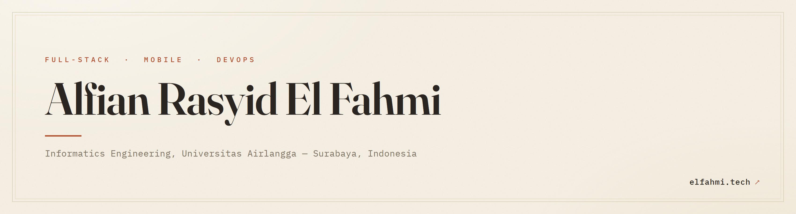

<!-- @ar-elfahmi GitHub Profile README -->

<div align="center">



<!-- Status badges -->
<a href="https://github.com/ar-elfahmi?tab=followers"></a>
<a href="https://www.google.com/maps/place/Surabaya"></a>


<!-- Typing animation -->
<a href="https://github.com/ar-elfahmi">
  
</a>

</div>

---

## 👨‍💻 &nbsp;About Me

```yaml
name: "Alfian Rasyid El Fahmi"
role: "Informatics Engineering Student"
based_in: "Surabaya, Indonesia 🇮🇩"
education: "Universitas Airlangga (UNAIR)"
focus: ["Full-Stack Web", "Mobile (Flutter/Kotlin)", "CI/CD & Blue-Green Deploy", "Server Management"]
hobbies: ["Reading Book 📚"]
motto: "First principles, then build."
```

I'm an Informatics Engineering student at **Universitas Airlangga** who enjoys shipping software end to end. I work across the stack, from Laravel and Flutter apps to the infrastructure that runs them: **Docker**, **GitHub Actions**, **Nginx reverse proxy**, **zero-downtime blue-green deployments**, and **Ubuntu server management**.

I like understanding a system from first principles, then building it to last.

---

## 🚀 &nbsp;Currently Building

<table>
  <tr>
    <td width="50%" valign="top">
      <h3 align="center">🔁 &nbsp;CI/CD & Blue-Green Deploy</h3>
      <p align="center"><em>Automating the path from commit to production.</em></p>
      <p align="center">
        
        
        
      </p>
      <p align="center">Pipelines that <b>test, audit, and build images</b>, then deploy with a <b>zero-downtime Nginx upstream flip</b>, healthchecks, and instant rollback.</p>
    </td>
    <td width="50%" valign="top">
      <h3 align="center">🖥️ &nbsp;Server & Container Management</h3>
      <p align="center"><em>Running production on lean hardware.</em></p>
      <p align="center">
        
        
        
      </p>
      <p align="center">Containerizing a Vue + Express + Postgres monorepo, reverse proxy with <b>Let's Encrypt HTTPS</b>, and keeping servers healthy on low-RAM VPS.</p>
    </td>
  </tr>
</table>

---

## 🛠️ &nbsp;Tech Stack

<table>
  <tr>
    <td align="center" width="50%"><b>💬 Languages</b></td>
    <td align="center" width="50%"><b>🧩 Frameworks & Libraries</b></td>
  </tr>
  <tr>
    <td align="center"></td>
    <td align="center"></td>
  </tr>
  <tr>
    <td align="center"><b>📱 Mobile & Cloud</b></td>
    <td align="center"><b>⚙️ DevOps & Tools</b></td>
  </tr>
  <tr>
    <td align="center"></td>
    <td align="center"></td>
  </tr>
</table>

<div align="center">

<sub>Also comfortable with: Midtrans (QRIS/VA) &nbsp;•&nbsp; Let's Encrypt / Certbot &nbsp;•&nbsp; Blue-Green Deployment &nbsp;•&nbsp; Cloudflare &nbsp;•&nbsp; GitHub Container Registry &nbsp;•&nbsp; Figma &nbsp;•&nbsp; OBS</sub>

</div>

---

## ✨ &nbsp;Projects

<table>
  <tr>
    <td width="50%" valign="top">
      <h3 align="center"><a href="https://github.com/ar-elfahmi/MindRest_AI">🧠 MindRest AI</a></h3>
      <p align="center"><em>Ikigai-driven sleep therapy AI assistant for Android.</em></p>
      <p align="center">
        
        
        
      </p>
    </td>
    <td width="50%" valign="top">
      <h3 align="center"><a href="https://github.com/ar-elfahmi/kantin-kita">🍱 Kantin Kita</a> &nbsp;<a href="https://kantin-kita.vercel.app"></a></h3>
      <p align="center"><em>Self-service campus canteen ordering with live QRIS payment.</em></p>
      <p align="center">
        
        
        
      </p>
    </td>
  </tr>
  <tr>
    <td width="50%" valign="top">
      <h3 align="center"><a href="https://github.com/ar-elfahmi/e-ticketing-helpdesk">🎫 E-Ticketing Helpdesk</a></h3>
      <p align="center"><em>Multi-role IT helpdesk ticketing app (User / Helpdesk / Admin).</em></p>
      <p align="center">
        
        
        
      </p>
    </td>
    <td width="50%" valign="top">
      <h3 align="center"><a href="https://github.com/ar-elfahmi/RecDit-RecommendationCredit">💰 RecDit</a> &nbsp;<a href="https://ar-elfahmi.github.io/RecDit-RecommendationCredit/"></a></h3>
      <p align="center"><em>Credit-limit recommender using Fuzzy Tsukamoto logic (vanilla JS).</em></p>
      <p align="center">
        
        
      </p>
    </td>
  </tr>
  <tr>
    <td width="50%" valign="top">
      <h3 align="center"><a href="https://github.com/ar-elfahmi/LoadSync">⚡ LoadSync</a></h3>
      <p align="center"><em>Intelligent solar energy management with load-shedding for mid-scale industry.</em></p>
      <p align="center">
        
        
      </p>
    </td>
    <td width="50%" valign="top">
      <h3 align="center"><a href="https://github.com/ar-elfahmi/Laravel-Rumah-Sakit-Pendidikan-AdminLTE">🏥 RSHP</a></h3>
      <p align="center"><em>Teaching-hospital management system built on AdminLTE.</em></p>
      <p align="center">
        
        
      </p>
    </td>
  </tr>
</table>

<div align="center">
  <a href="https://github.com/ar-elfahmi?tab=repositories">
    
  </a>
</div>

---

## 📊 &nbsp;GitHub Activity

<div align="center">

<!-- Contribution graph (reliable) -->


<br/><br/>

<!-- Streak (reliable) -->


</div>

---

## 📫 &nbsp;Connect With Me

<div align="center">

<a href="https://github.com/ar-elfahmi"></a>
<a href="https://linkedin.com/in/alfian-re-fahmi"></a>
<a href="https://www.instagram.com/rasyid.elfahmi/"></a>

</div>

---

<div align="center">


&nbsp;


<br/><br/>

<sub>⭐️ From <a href="https://github.com/ar-elfahmi">@ar-elfahmi</a>, built with curiosity and a lot of coffee ☕</sub>

<sub><i>"First principles, then build."</i></sub>

</div>
